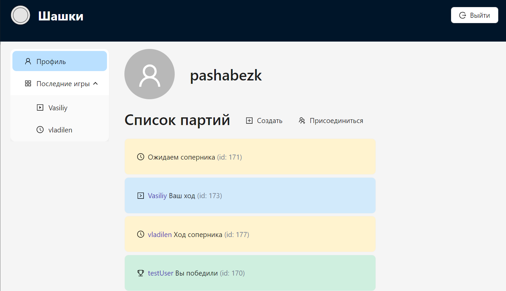
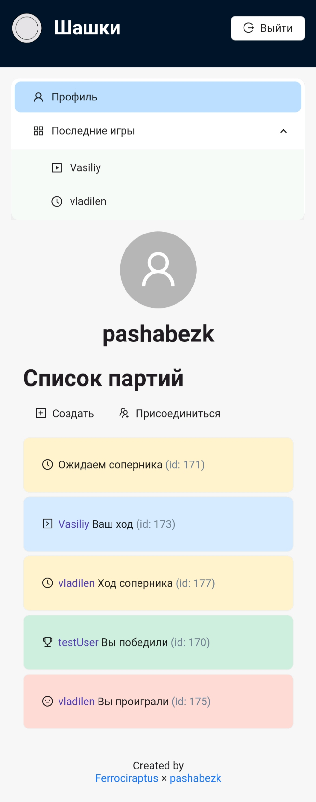
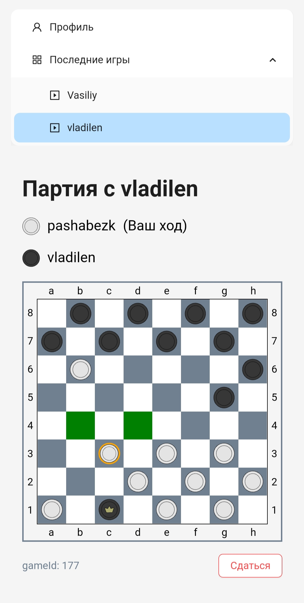
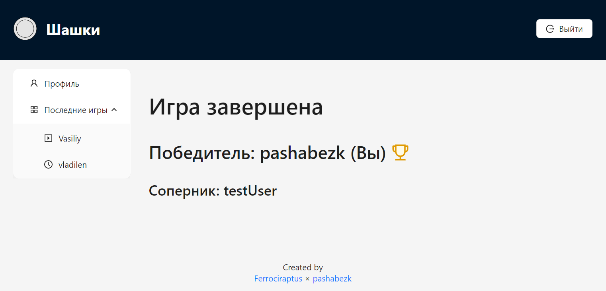
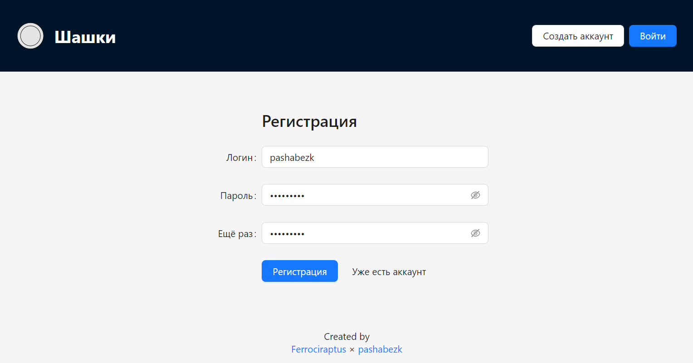
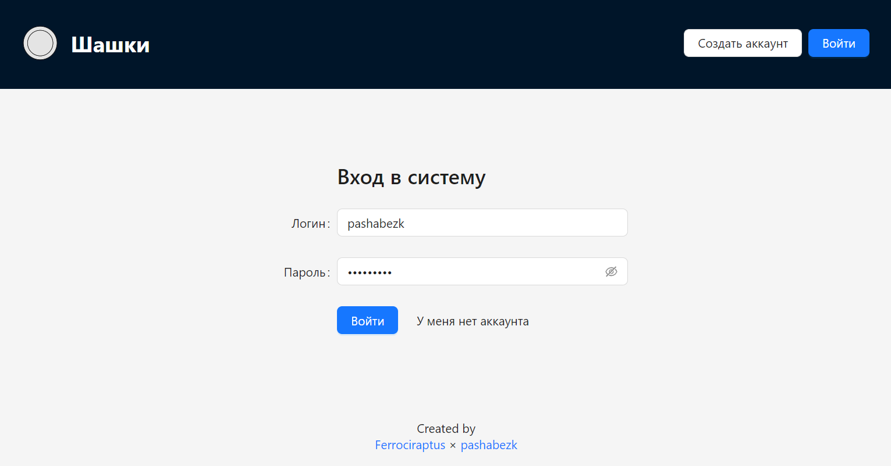
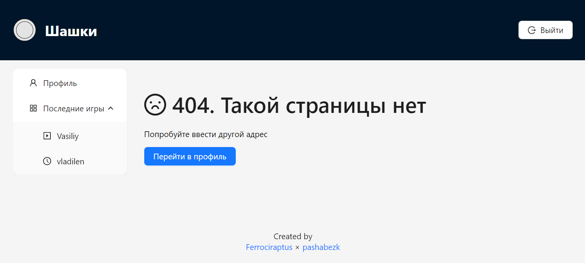

# Шашки онлайн | измененнные

Фронтенд часть приложения для сервиса игры в шашки онлайн.

Бекенд часть расположена на [https://home.ferrion.tech/](https://home.ferrion.tech/).

Ссылка на документацию по АПИ: [https://home.ferrion.tech/q/swagger-ui/](https://home.ferrion.tech/q/swagger-ui/)

## Посмотреть результат
Фронтенд часть хостится на github-pages: [https://pashabezk.github.io/CheckersOnlineFrontend/](https://pashabezk.github.io/CheckersOnlineFrontend/).

Если вдруг не получается выполнить никакие действия, значит отключен бекенд-сервер.

## Как запустить локально
1. Чтобы проект запустился, необходимо предварительно установить [Node.js](https://nodejs.org/en/).
2. Для локального запуска необходимо скачать архив проекта или склонировать себе репозиторий `git clone https://github.com/pashabezk/CheckersOnlineFrontend`.
3. Далее необходимо перейти в корневую папку проекта `cd CheckersOnlineFrontend`.
4. Перед первым запуском необходимо установить все зависимости с помощью команды `npm install`.
5. Для запуска проекта используйте команду `npm start`.
> Запуск проекта занимает продолжительное время
6. После запуска должно автоматически открыться окно в браузере с проектом. Если этого не произошло автоматически, откройте самостоятельно адрес [http://localhost:3000](http://localhost:3000).

## Демонстрация работы
Ниже представлено несколько скриншотов, демонстрирующих интерфейс приложения.

#### Профиль пользователя
В профиле отображается информация о партиях. В зависимости от статуса партии, она выделяется цветом

Дизайн сайта является адаптивным, поэтому он хорошо смотрится как на больших экранах, так и на мобильных устройствах

#### Игровое поле

#### Экран завершённой партии

#### Экраны регистрации и авторизации
 

#### 404 error

